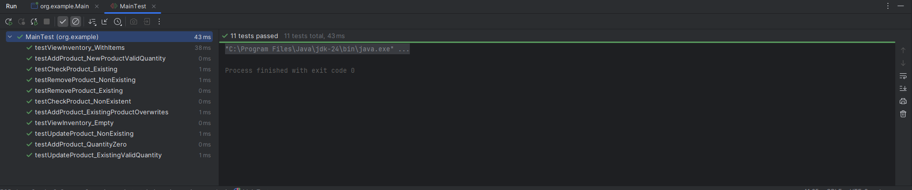

# General Malit
## Lab 1 - Grocery Store

Part 1: How the menu looks like and sample of some of its output.

Part 2: 11 Unit tests for the whole program.

- `testAddProduct_NewProductValidQuantity`: Verifies adding a new product with a positive quantity.
- `testAddProduct_QuantityZero`: Confirms that a product can be added with a quantity of zero.
- `testAddProduct_ExistingProductOverwrites`: Ensures adding an existing product updates its quantity.
- `testCheckProduct_Existing`: Validates checking the stock of an existing product.
- `testCheckProduct_NonExistent`: Confirms correct behavior when checking a non-existent product.
- `testUpdateProduct_ExistingValidQuantity`: Tests updating the quantity of an existing product.
- `testUpdateProduct_NonExisting`: Verifies handling of updating a non-existent product.
- `testRemoveProduct_Existing`: Ensures an existing product can be successfully removed.
- `testRemoveProduct_NonExisting`: Confirms correct behavior when attempting to remove a non-existent product.
- `testViewInventory_Empty`: Tests viewing an empty inventory.
- `testViewInventory_WithItems`: Validates viewing inventory when it contains multiple items.

